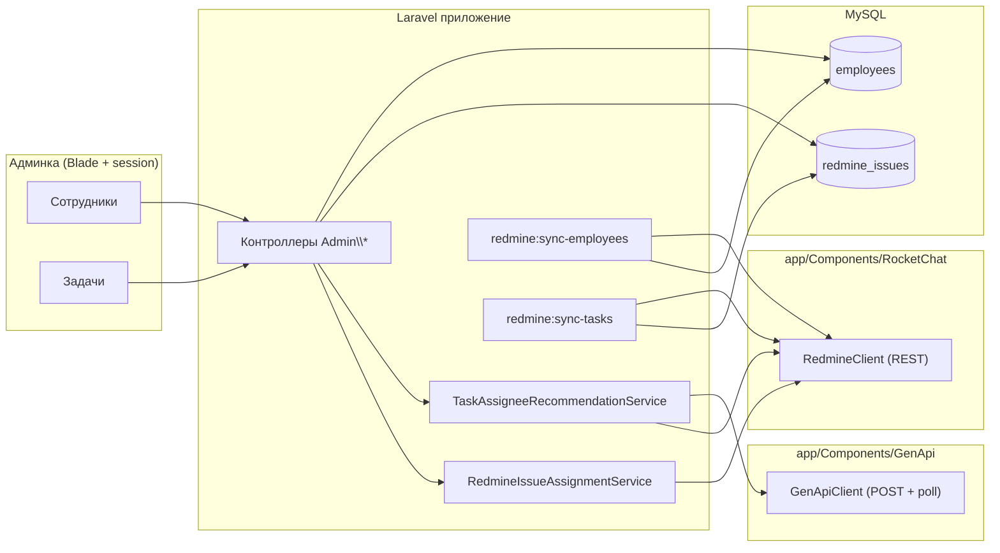
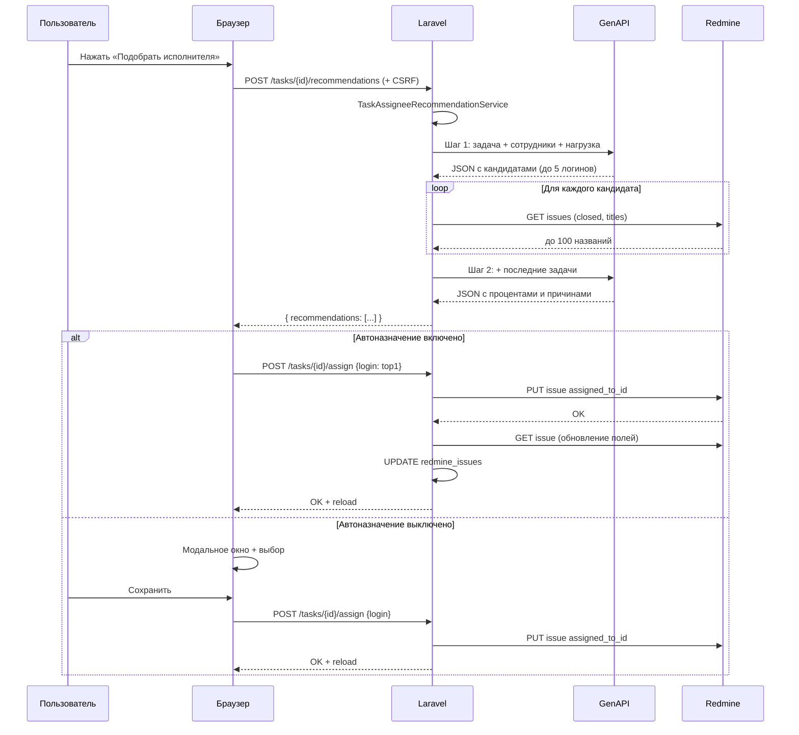
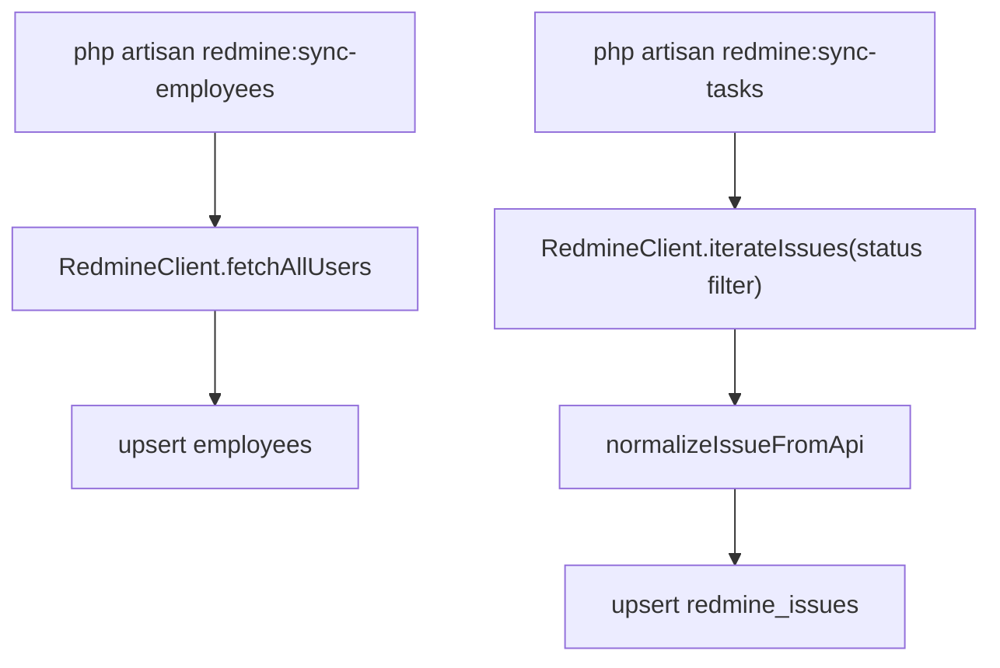

# Архитектура AI-management

Ниже — обзор потоков данных и компонентов. Диаграммы в формате [Mermaid](https://mermaid.js.org/) (рендерятся на GitHub/GitLab и во многих IDE).

## Общая схема

## Подбор исполнителя (UI + GenAPI + Redmine)

## Синхронизация

## Конфигурация

| Область        | Файл `config/*.php` | Основные переменные `.env`        |
|----------------|---------------------|-----------------------------------|
| Админ-вход     | `admin.php`         | `ADMIN_USERNAME`, `ADMIN_PASSWORD_HASH`, `ADMIN_PASSWORD` |
| Redmine        | `redmine.php`       | `REDMINE_BASE_URL`, `REDMINE_API_KEY`, `REDMINE_ISSUE_STATUS_FILTER`, `REDMINE_IN_PROGRESS_STATUS_NAMES` |
| GenAPI         | `genapi.php`        | `GENAPI_BASE_URL`, `GENAPI_API_KEY`, `GENAPI_STEP1_NETWORK_ID`, `GENAPI_STEP2_NETWORK_ID`, `GENAPI_EXTRA_JSON_BODY` |

## Примечание по каталогу `RocketChat`

По техническому заданию весь код интеграции с **Redmine** размещён в `app/Components/RocketChat` (имя каталога зафиксировано в ТЗ). Функционально это клиент Redmine REST API (`RedmineClient`).
